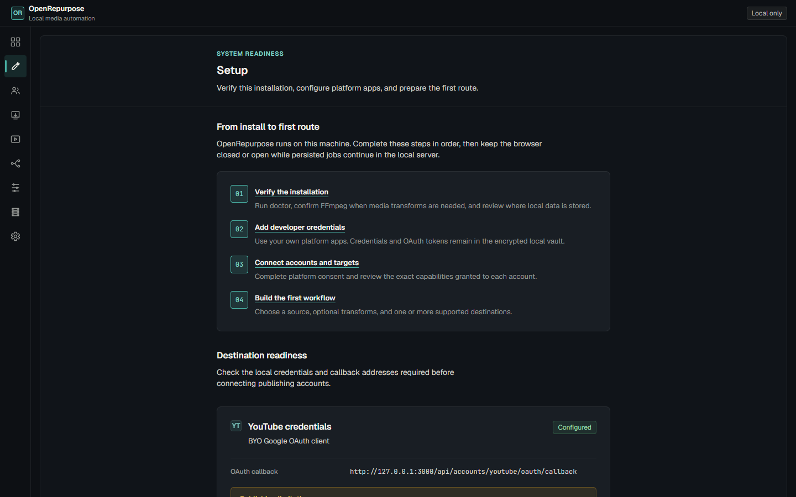

# OpenRepurpose

OpenRepurpose is a local-first, open-source media automation workbench for Windows and Linux. It
combines local files and authorized platform sources with deterministic transforms, persistent
workflows, and official publishing APIs. The web interface, CLI, scheduler, API, MCP server, SQLite
database, and job runner all run on infrastructure you control; no OpenRepurpose cloud account is
required.



## What it does

- imports local media without loading large files fully into memory;
- polls supported YouTube, Twitch, and Kick sources;
- publishes to YouTube, TikTok, Facebook Pages, and Instagram professional accounts through official APIs;
- runs restart-safe workflows, schedules, FFmpeg transforms, and local whisper.cpp transcription;
- supports OBS recording and Replay Buffer watched-folder workflows;
- exposes shared application services through the web UI, CLI, local REST API, and stdio MCP server;
- keeps platform credentials in an encrypted local vault and sends no telemetry by default.

You must own or be authorized to reuse every media item. OpenRepurpose does not bypass DRM,
authentication, platform audits, review requirements, rate limits, or visibility restrictions.

## Quick start

### Windows x64 portable release

1. Download the Windows x64 ZIP and its published checksum.
2. Verify the checksum, extract the archive to a user-writable folder, and keep that installation
   folder separate from your application data.
3. In PowerShell, run:

   ```powershell
   .\openrepurpose.cmd doctor
   .\openrepurpose.cmd start
   ```

4. Open the loopback URL printed by the server, normally `http://127.0.0.1:3000`.
5. Open **Setup**, follow the local guide, then configure developer credentials under **Accounts**.

See [Windows installation and upgrade](docs/quick-start-windows.md).

### Linux x64 portable release

```sh
sha256sum -c OpenRepurpose-linux-x64.tar.xz.sha256
tar -xJf OpenRepurpose-linux-x64.tar.xz
cd OpenRepurpose
./openrepurpose doctor
./openrepurpose start
```

The Linux artifact targets x86_64 glibc systems. Linux arm64 and musl artifacts are not currently
released. See [Linux installation and service operation](docs/quick-start-linux.md).

### Docker/headless

Docker is an optional technical-user deployment. The repository image does not bundle FFmpeg,
ffprobe, whisper.cpp, or model files. Compose publishes only to host loopback by default and requires
an explicit LAN access token for the container boundary. Follow
[Docker and headless deployment](docs/docker-headless.md).

## First workflow

1. Run `openrepurpose doctor` and install/configure FFmpeg only if the workflow needs probing or transforms.
2. Create your own developer app for each platform and register the exact OAuth callback shown in **Setup**.
3. Save credentials and connect accounts under **Accounts**.
4. Add a local, watched-folder, YouTube, Twitch, or Kick source.
5. Create a workflow, start with a preset where appropriate, and keep advanced stages collapsed until needed.
6. Inspect durable execution and recovery information under **Jobs**.

Read the [workflow tutorial](docs/workflow-tutorial.md) and [OBS guide](docs/obs.md). Platform setup
begins at [docs/platform-setup](docs/platform-setup/README.md), including the reasons OpenRepurpose
requires BYO developer credentials and the audits/reviews that can limit publishing.

## Optional media tools

Portable releases deliberately exclude FFmpeg/ffprobe, whisper.cpp binaries, and model weights.
Choose trusted builds, verify their provenance, and configure absolute executable/model paths. No
model is downloaded until you explicitly request it. See [FFmpeg setup](docs/ffmpeg.md) and
[whisper.cpp architecture](docs/architecture/WHISPER_CPP.md).

## Data, privacy, and recovery

- [Data locations](docs/data-locations.md)
- [Backup and restore](docs/backup-restore.md)
- [Privacy and security model](docs/privacy-security.md)
- [Troubleshooting](docs/troubleshooting.md)
- [Uninstall and data removal](docs/uninstall.md)

Portable backups are secret-free: they include the SQLite state but exclude the vault/key, tokens,
media, derivatives, and models. Restored accounts must be reconnected.

## Automation and extension

- [Local API and MCP](docs/mcp-api.md)
- [Plugin author guide](docs/plugin-author.md)
- [Plugin SDK compatibility and trust model](docs/PLUGIN_SDK.md)
- [Self-hosting and authenticated LAN mode](docs/self-hosting.md)

Third-party plugins execute in-process with the same operating-system privileges as OpenRepurpose.
They are disabled by default; declared permissions are review metadata, not a sandbox.

## Build from source

Source development requires Node.js 24.21.0 and pnpm 12.4.2, both pinned by the repository.

```text
corepack pnpm install --frozen-lockfile
corepack pnpm typecheck
corepack pnpm lint
corepack pnpm test
corepack pnpm build
corepack pnpm test:e2e
```

`corepack pnpm dev` starts Fastify on `127.0.0.1:3000` and Vite on `127.0.0.1:5173`.
`corepack pnpm build` followed by `corepack pnpm start` serves the production UI and API from one
loopback origin. Configuration is documented in [`.env.example`](.env.example).

## Architecture

OpenRepurpose is a deployment-neutral modular monolith:

```text
Web UI / CLI / REST / MCP / scheduler
                 |
         application services
                 |
      domain and workflow engine
                 |
 SQLite · local filesystem · job runner · FFmpeg · platform adapters
```

Business behavior is shared across entry points. Integrations implement explicit adapters and do
not control workflows; persistence stays behind repositories; long-running work is stored before it
runs. See [ADR 0001](docs/adr/0001-local-first-modular-monolith.md) and
[UI architecture](docs/UI_ARCHITECTURE.md).

## Contributing and license

See [CONTRIBUTING.md](CONTRIBUTING.md), the [release process](docs/release-process.md), and
[SECURITY.md](SECURITY.md). OpenRepurpose is licensed under
[GNU AGPL version 3 only](LICENSE). Third-party notices are in
[THIRD_PARTY_NOTICES.md](THIRD_PARTY_NOTICES.md).
